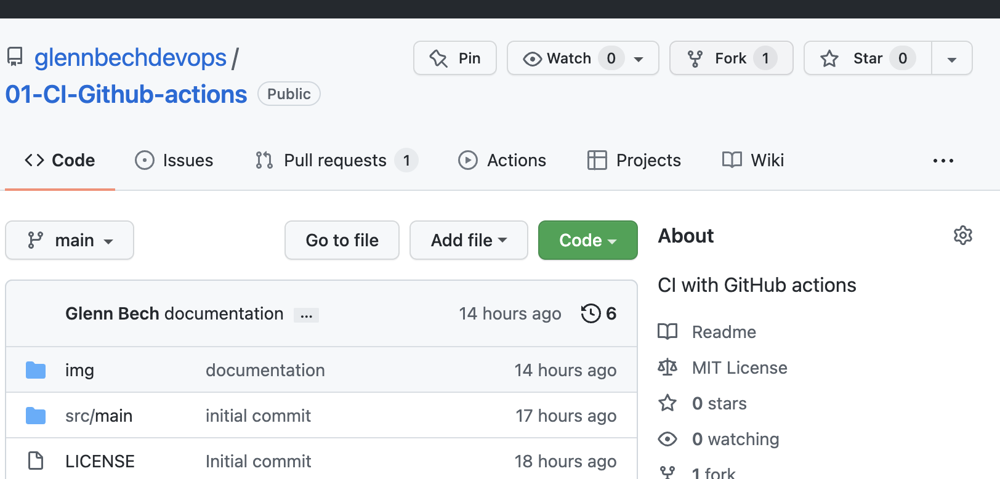
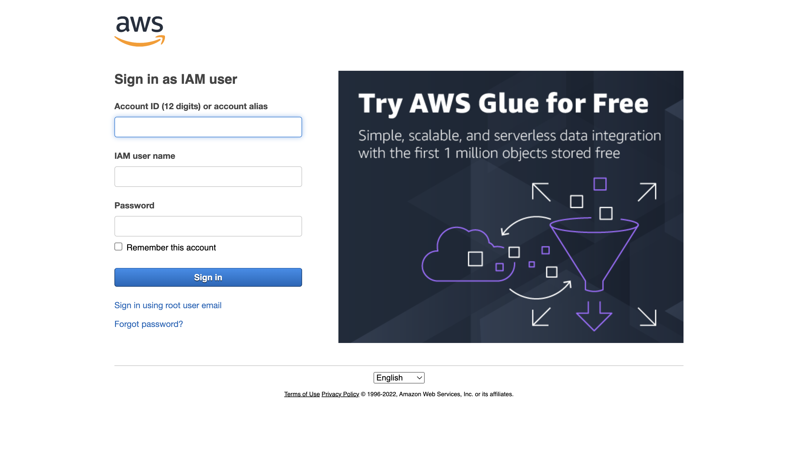
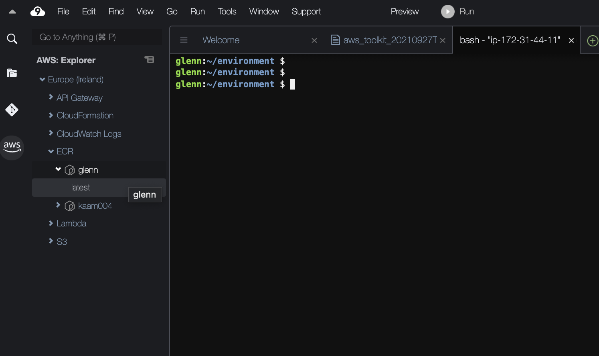
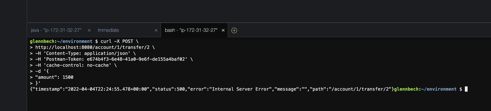
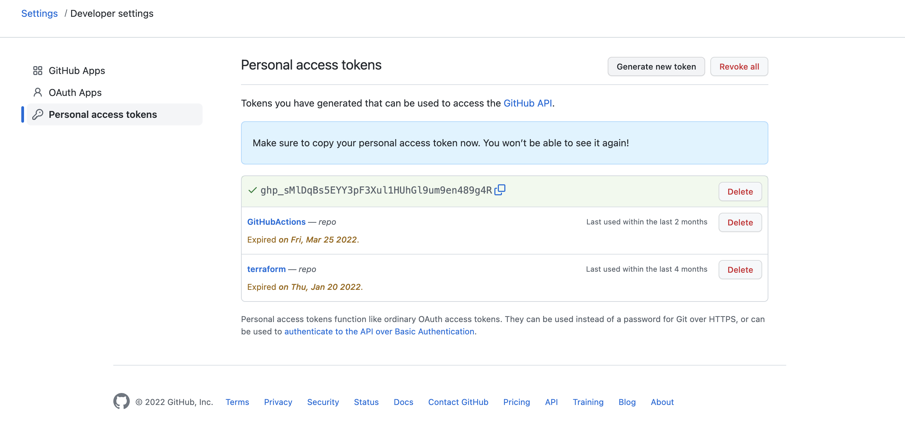
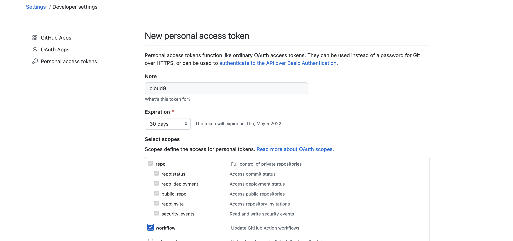
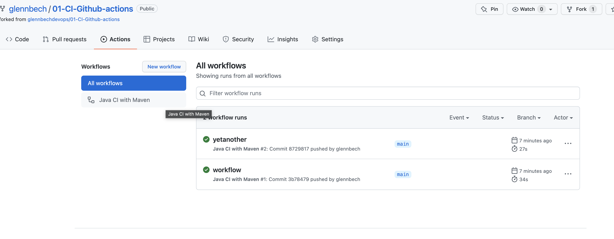
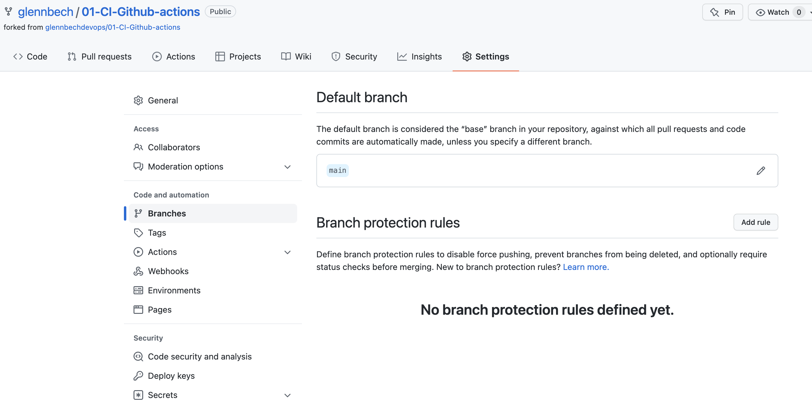
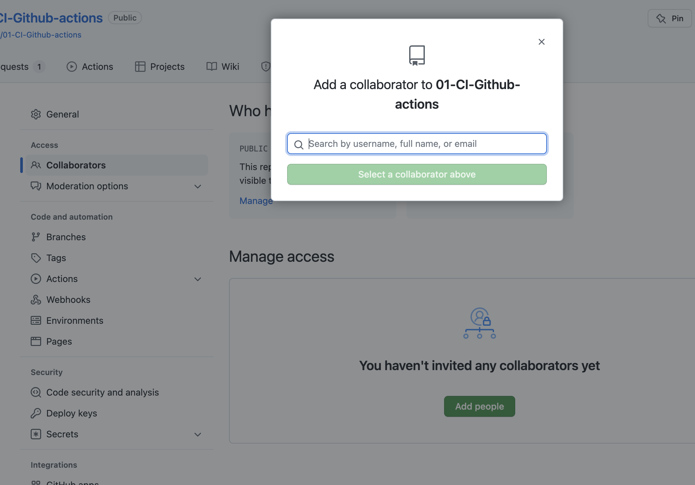

# LAB - CI med GitHub actions 

## Litt om eksempel-appen

En norsk bank har brukt flere år og hundretalls milioner på å utvikle et moderne kjernesystem for bank og et "fremoverlent" API som nesten tilfredsstiller Directive (EU) 2015/2366 of the European Parliament and of the Council on Payment Services in the Internal Market, published 25 November 2016 også kjent som PSD.

Dette er en viktig satsning innen området "Open Banking" for SkalBank.

Arkitekturmessig består systemet av to komponenter.

Et API, implementert ved hjelp av Spring Boot. Koden for applikasjonen ligger i dette repoet.
Et kjernesystem som utfører transaksjoner med andre banker, avregner mot Norges bank osv. Dere kan late som metodekall 
som gjøres mot klassen ```ReallyShakyBankingCoreSystemService```, kommuniserer med dette systemet.

I denne øvingen skal vi se på viktige DevOps prinsipper som 

- GitHub actions
- Trunk based development 
- Feature branches
- Branch protection 
- Pull requests

Dere blir også kjent med Cloud 9 utviklingsmiljøet dere skal bruke videre. 

## Før dere starter

- Dere trenger en GitHub Konto
- Lag en fork av dette repositoriet inn i egen GitHub konto



### Sjekk ut AWS Cloud 9 miljøet ditt

* Logg på Cloud 9 med en URL gitt i klasserommet, URLen kan feks se slik ut ; 
https://eu-west-1.console.aws.amazon.com/cloud9/ide/f1ffb95326cd4a27af3bd4783e4af974



* Bruk kontonummer 244530008913
* Brukernavnet og passordet er gitt i klasserommet
* Hvis du velger "9" ikonet på øverst til venstre i hovedmenyen vil du se "AWS Explorer". Naviger gjerne litt rundt I 
* AWS Miljøet ofr å bli kjent.



Start en ny terminal i Cloud 9 ved å trykke (+) symbolet på tabbene



Kjør denne kommandoen for å verifisere at Java 11 er installert

```shell
java -version
```
Du skal få 
```
openjdk 11.0.14.1 2022-02-08 LTS
OpenJDK Runtime Environment Corretto-11.0.14.10.1 (build 11.0.14.1+10-LTS)
OpenJDK 64-Bit Server VM Corretto-11.0.14.10.1 (build 11.0.14.1+10-LTS, mixed mode)
```

### Installer Maven i Cloud 9 

Kopier disse kommandoene inn i Cloud9 terminalen. De vil installere Maven. 
```shell
sudo wget http://repos.fedorapeople.org/repos/dchen/apache-maven/epel-apache-maven.repo -O /etc/yum.repos.d/epel-apache-maven.repo
sudo sed -i s/\$releasever/6/g /etc/yum.repos.d/epel-apache-maven.repo
sudo yum install -y apache-maven
```

### Lag et Access Token for GitHub

Når du skal autentisere deg mot din GitHub konto fra Cloud 9 trenger du et access token.  Gå til  https://github.com/settings/tokens og lag et nytt. 



Access token må ha "repo" tillatelser, og "workflow" tillatelser.



### Lage en klone av din Fork (av dette repoet) inn i ditt Cloud 9 miljø

For å slippe å autentisere seg hele tiden kan man få git til å cache nøkler i et valgfritt 
antall sekunder. 

* OBS! Anta at det er mulig for kollegaer å få tilgang til ditt Cloud 9 miljø.   

```shell
git config --global credential.helper "cache --timeout=86400"
```

Lag en klone

```shell
git clone https://github.com/≤github bruker>/01-CI-Github-actions.git
```

* Forsøk å kjøre applikasjonen 
```shell
cd 01-CI-Github-actions
mvn spring-boot:run
```

Start en ny terminal i Cloud 9 ved å trykke (+) symbolet på tabbene


Du kan teste applikasjonen med CURL fra Cloud 9

```
curl -X POST \
http://localhost:8080/account/1/transfer/2 \
-H 'Content-Type: application/json' \
-H 'Postman-Token: e674b4f3-6e48-41a0-9e6f-de155a4baf02' \
-H 'cache-control: no-cache' \
-d '{
"amount": 1500
}'
```

Husk at dette er applikasjonen "Shakybank", en 500 Internal server error er svært vanlig :-)
```json
{
  "timestamp": "2022-04-04T21:34:45.542+00:00",
  "status": 500,
  "error": "Internal Server Error",
  "message": "",
  "path": "/account/1/transfer/2"
}
```
Når du ikke får noe output fra terminalen etter CURL kommandoen har requesten gått bra. 

## Lag en GitHub Actions workflow
Bruk  Cloud 9 til å lage to mapper og en fil som heter ````.github/workflows/main.yml```` under rotmappen til repositoriet du har klonet.

```yaml
# This workflow will build a Java project with Maven, and cache/restore any dependencies to improve the workflow execution time
# For more information see: https://help.github.com/actions/language-and-framework-guides/building-and-testing-java-with-maven
name: Java CI with Maven
on:
  push:
    branches: [ main ]
  pull_request:
    branches: [ main ]
jobs:
  build:
    runs-on: ubuntu-latest
    steps:
    - uses: actions/checkout@v2
    - name: Set up JDK 11
      uses: actions/setup-java@v2
      with:
        java-version: '11'
        distribution: 'adopt'
        cache: maven
    - name: Build with Maven
      run: mvn -B package --file pom.xml
```


Dette er en vekdig enkel *workflow* med en *job* som har en rekke *steps*. Koden sjekkes ut. JDK11 konfigureres,
Maven lager en installasjonspakke.

Commit og push til ditt repo. 

```shell
cd 01-CI-Github-actions
git add .github/workflows/main.yml 
git commit -m"workflow"
git push
```

*OBS*
Når du gjør en ```git push``` må du autentisere deg. Du må bruke et GitHub Access token når du blir bedt om passord.

## Sjekk at workflow er aktivert 

* Gå til din fork av dette repoet på Github 
* Velg "Actions" - du skal se at en jobb er kjørt.

* 

Gjør en endring i koden, gjerne i main branch, commit og push. Observer mens commit hendelsen starter WorkFlowen, og jobben kjører.

## Konfigurer main som beskyttet branch



Vi skal nå sørge for at bare kode som kompilerer og med tester som kjører, inn i main branch.
Det er også bra praksis å ikke comitte kode direkte på main, så vi skal gjøre det umulig å gjøre dette. 

Ved å konfigurerere main som en beskyttet branch, og ved å bruke "status sjekker" kan vi 
- Gåt til din fork av dette repoet.  
- Gå til Settings/Branches og Se etter seksjonen "Branch Protection Rules".
- Velg *Add*
- Velg *main* Som branch
- Velg ```require a pull request before merging```
- Velg ````Require status check to pass before merging````
- I søkefeltet skriv inn teksten *build* som skal la deg velge "GitHub Actions". 

* Nå kan vi ikke Merge en pull request inn i Main uten at status sjekken er i orden. Det betyr at vår Workflow har kjørt OK. 
* Ingen i teamet kan heller "snike seg unna" denne sjekken ved å comitte kode rett på main branch.
* En bra start!

## Test å brekke koden 

- Lag en ny branch 

```
git checkout -b will_break_4_sure
```
- Lag en kompileringsfeil
- Commit og push endringen til GitHub 

```shell
 git add src/
 git commit -m"compilation error introduced"
 git push --set-upstream origin will_break_4_sure
```

- OBS! GitHub velger repository du lagde forken FRA som kilde når du lager en pull request første gang. Du må endre nedtrekksmenyen til ditt eget repo.
- Gå til ditt repo på GitHub.com og forsøk å lage en Pull request fra din branch ```will_break_4_sure``` til main. 
- Sjekk at du ikke får lov til å gjøre en Merge fordi koden ikke kompilerer

## Peer review

- Gå til gitHub.com og din fork av dette repoet.
- Gå til Settings/Branches og Se etter seksjonen "Branch Protection Rules".
- Velg *main* branch
- Velg "Edit" for  eksisterende branch protection rule
- Under ````Require a pull request before passing````
- Kryss deretter av for ````Require approvals````

## Test


 
- Legg til en annen person som "collaborator" i ditt repo
- Gå til Github og lag en ny Pull request, som vist over 
- Få personen til å godkjenne din pull request
- Forsøk gjerne å fremprovosere en feil ved å få en unit test til å feile. 
- Legg merke til at det fortsatt er mulig å merge til ```main```.


Ferdig!
