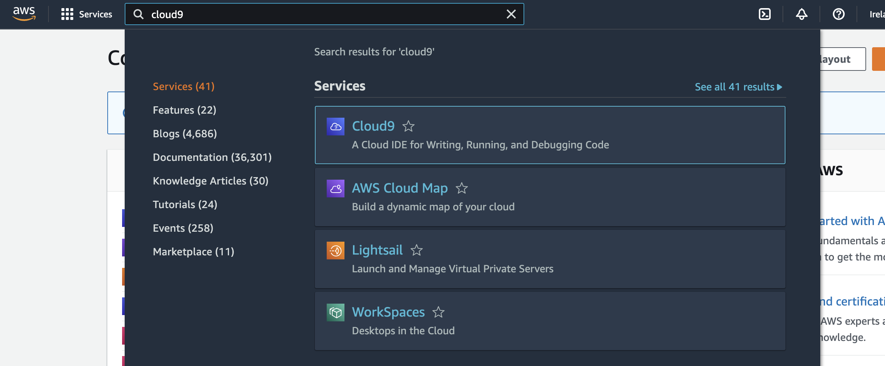

# LAB - bli kjent med AWS og Cloud 9

I denne labben vil dere bli kjent med  

* Et utviklingsmiljø basert på AWS Cloud9
* Hvordan dere lager "forks" og kloner egne repoer til AWS Cloud 9 miljøene
* Hvordan dere kan kompilere og bygge Javabaseerte applikasjoner i Cloud9 med Maven

# AWS Cloud 9 

AWS Cloud9 er en skybasert integrert utviklingsmiljø (IDE) fra Amazon Web Services. Denne plattformen gir utviklere muligheten til å kode, redigere og feilsøke applikasjoner direkte fra nettleseren, noe som eliminerer behovet for lokale IDE-installasjoner. Med funksjoner som sanntids samarbeid, forhåndsinnstilte utviklingsmiljøer, intelligent kodefullføring og integrasjon med AWS-tjenester, muliggjør Cloud9 en smidig og effektiv utviklingsprosess.

I PGR301 bruker vi Cloud 9 så vi slipper å bruke masse tid på å konfigurere hver enkelt PC/MAC med verktøy som Docker, Java, Maven osv.  

## Litt om eksempel-appen

Målet med laben er å gjøre dere kjent med AWS Cloud9 - et utviklingsverktøy vi skal bruke i lab-øvelsene. 
Dette repositoryet inneholder en Spring Boot eksempel app. Appen ble brukt som eksamensoppgave i 2021.

beskrivelse fra eksamen: 

En norsk bank har brukt flere år og hundretalls milioner på å utvikle et moderne kjernesystem for bank og et "fremoverlent" API som nesten tilfredsstiller Directive (EU) 2015/2366 of the European Parliament and of the Council on Payment Services in the Internal Market, published 25 November 2016 også kjent som PSD.
Dette er en viktig satsning innen området "Open Banking" for den nye nordiske banken BedreBank.
Arkitekturmessig består systemet av to komponenter.

* Et API, implementert ved hjelp av Spring Boot. Koden for applikasjonen ligger i dette repoet.
* Et kjernesystem som utfører transaksjoner med andre banker, avregner mot Norges bank osv. Klassen ```ReallyShakyBankingCoreSystemService``` simulerer dette systemet.

## Før dere starter

- Dere trenger en GitHub Konto
- Lag en _fork_ av dette repositoriet inn i din egen GitHub konto

### Sjekk ut Cloud 9 miljøet ditt i AWS og bli kjent med det

* URL for innlogging er https://244530008913.signin.aws.amazon.com/console
* Brukernavnet og passordet er gitt i klasserommet

* Fra hovedmenyen, søk etter tjenesten "cloud9"



* Velg "My environments" fra venstremenyen hvis du ikke ser noen miljøer med ditt navn
* Hvis du ikke ser noe å trykke på som har ditt navn, pass på at du er i rett region (gitt i klasserommet)
* Velg "Open in Cloud9"

Du må nå vente litt mens Cloud 9 starter 

* Hvis du velger "9" ikonet på øverst til venstre i hovedmenyen vil du se "AWS Explorer". Naviger gjerne litt rundt I AWS Miljøet for å bli kjent.
* Blir kjent med IDE, naviger rundt.


Start en ny terminal i Cloud 9 ved å trykke (+) symbolet på tabbene


Kjør denne kommandoen for å verifisere at Java 11 er installert

```shell
java -version
```
Du skal få 
```
openjdk version "11.0.20" 2023-07-18 LTS
OpenJDK Runtime Environment Corretto-11.0.20.8.1 (build 11.0.20+8-LTS)
OpenJDK 64-Bit Server VM Corretto-11.0.20.8.1 (build 11.0.20+8-LTS, mixed mode)
```

### Installer Maven i Cloud 9 

Kopier disse kommandoene inn i Cloud9 terminalen. De vil installere Maven. 
```shell
sudo wget http://repos.fedorapeople.org/repos/dchen/apache-maven/epel-apache-maven.repo -O /etc/yum.repos.d/epel-apache-maven.repo
sudo sed -i s/\$releasever/6/g /etc/yum.repos.d/epel-apache-maven.repo
sudo yum install -y apache-maven
```

### Klone din Fork (av dette repoet) inn i ditt Cloud 9 miljø

Fra terminalen i Cloud 9, lag en klone. 

```shell
git clone https://github.com/≤github bruker>/00-welcome-to-cloud9.git
```

* Forsøk å kjøre applikasjonen 
```shell
cd 00-welcome-to-cloud9
mvn spring-boot:run
```
Dette vil ta litt tid. Maven må bygge applikasjonene, og laste ned alle avhengigheter osv. 

Vent til applikasjonen har startet

Start en ny terminal i Cloud 9 ved å trykke (+) symbolet på tabbene


```
curl er et kommandolinjeverktøy som brukes til å overføre data til eller fra en server ved hjelp av
forskjellige protokoller, som HTTP, HTTPS, FTP, SFTP, og mange andre. Navnet "curl" står for "Client URL".
```

Du kan teste applikasjonen med "CURL" fra Cloud 9. Curl gjør Http requester fra terminal/komamndlinje istedet for 
Postman. Dette API kallet overfører 1500 NOK fra konto 1 til konto 2
 
```
curl -X POST \
http://localhost:8080/account/1/transfer/2 \
-H 'Content-Type: application/json' \
-H 'Postman-Token: e674b4f3-6e48-41a0-9e6f-de155a4baf02' \
-H 'cache-control: no-cache' \
-d '{
"amount": 1500
}'
```

Husk at dette er applikasjonen "Shakybank", en 500 Internal server error er svært vanlig! Se om du kan endre koden til å feile med 500 server error med litt 
lavere sansynlighet. Stopp applikasjonen og start på den nytt med ny "probability" for feil. Test APIet på nytt. 


```json
{
  "timestamp": "2022-04-04T21:34:45.542+00:00",
  "status": 500,
  "error": "Internal Server Error",
  "message": "",
  "path": "/account/1/transfer/2"
}
```
Når du ikke får noe output fra terminalen etter CURL kommandoen har requesten gått bra. 

## Done !

* Du har logget på- og fått tilgang til AWS.
* Du har nå blitt kjent med Labmiljøet vi skal bruke videre i kurset 
* Du har lært at du kan bruke _curl_ for å teste APIer 
* Du er blitt kjent med "shakybank" APIet
